# DS_Mod_3_Income_classifier
Project attmepts to build an income level clasification model by applying various classification algorithms.  

## Task
Predicting income level (below or above 50K / year) based on various socio-economic attributes.  

## Data
The dataset is taken from UCI machine learning repository.  
Extraction was done from the 1994 Census database.  

**Target Variable:**  
income level >50K and <=50K

**Attributes:**  
age, workclass, fnlwgt, education, education-num, marital-status, relationship, race, sex, capital-gain, capital-loss, hours-per-week, native-country

## Some of the data cleaning operations performed:
* useless and redundant columns removed ('fnlwgt', 'capital-gain', 'capital-loss', 'relationship')
* transformation of categorical variables into 1 and 0
* values that made no meaningful sense were removed
* in order to cut down the amount of categories in variables, some of the values were removed or merged with larger categories where it was meaningful 
* outliers were removed based on 3sd principle

## EDA insights
* Potential issue with class inbalance  
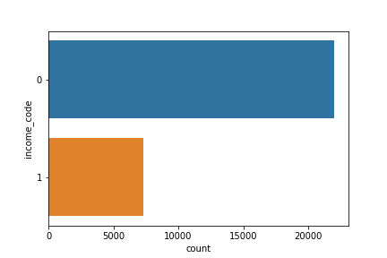 

* Gender by income distribution  
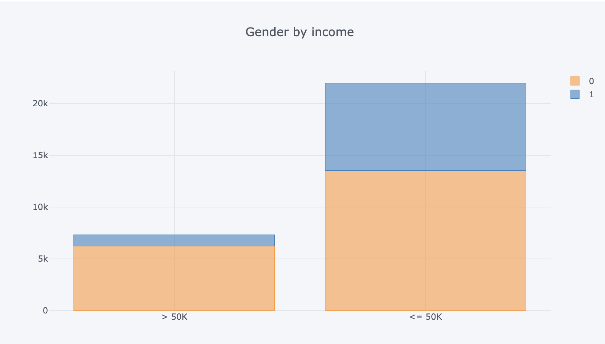 

* Marital status by income distribution
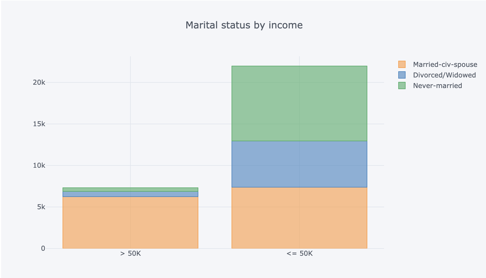  

* Education by income distribution
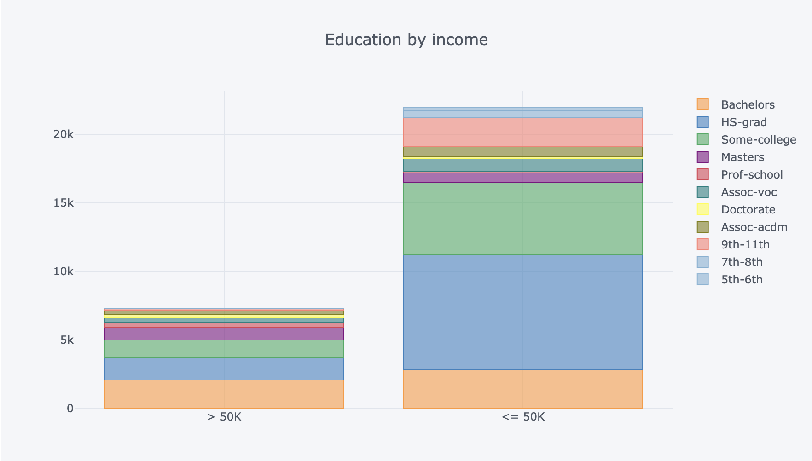  

* Working sector by income distribution
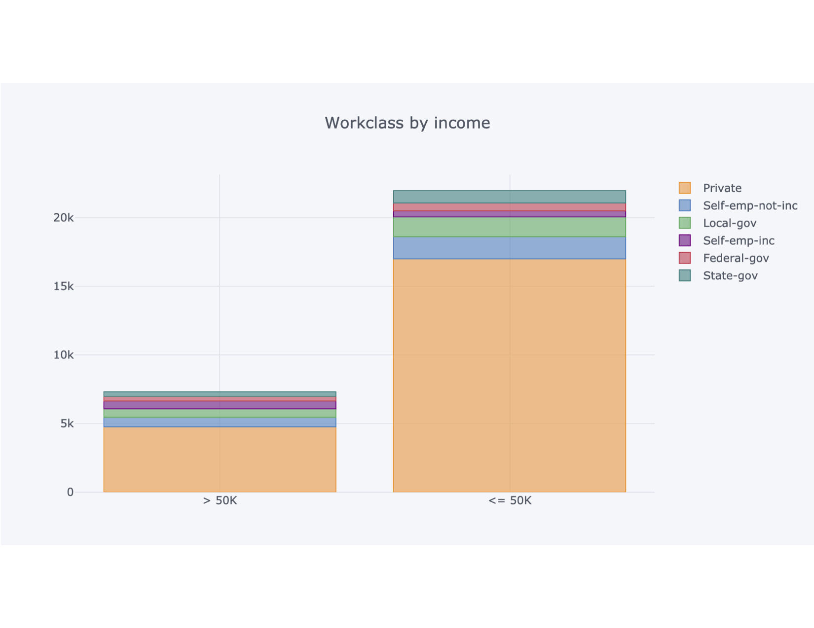  

* Difference in age and income distribution by gender  
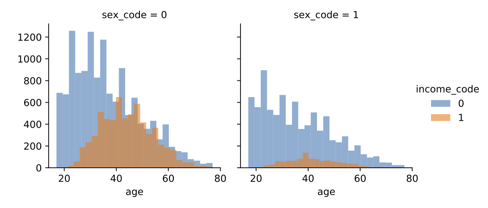 

* Difference in education and income distribution by gender  
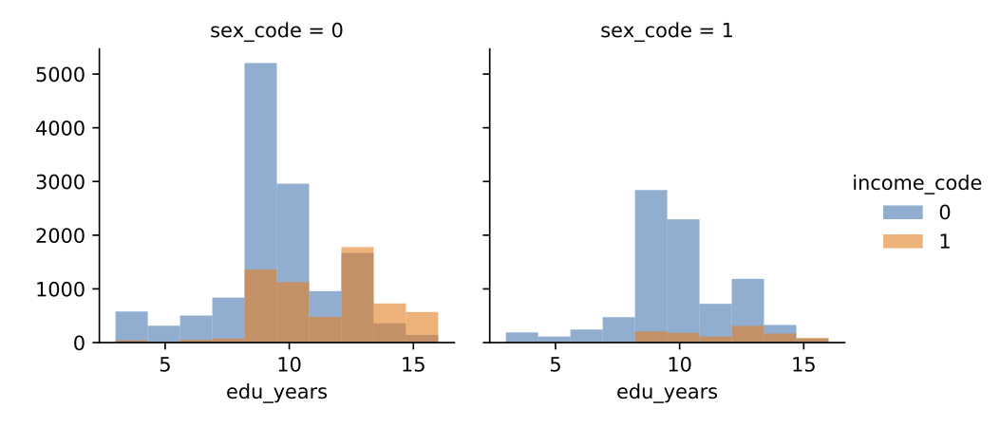 

## Initial modelling (no interraction terms, no rebalancing, no feature selection)
**LogReg**  

LogReg Accuracy: 0.8326965065502183  
LogReg Precision: 0.6986869384934347  
LogReg Recall: 0.5613548028872848  

Training F1 Score: 0.6207035988677719  
Testing F1 Score: 0.6225369458128078  

* Confusion matrix  
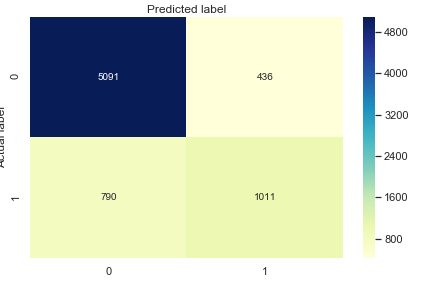 

**KNN**

KNN Accuracy:0.8122270742358079  
KNN F1: 0.6039147956246402  

* Confusion matrix  
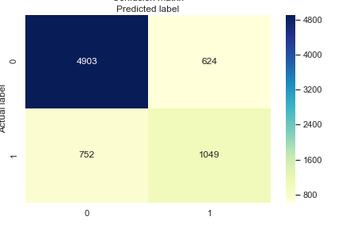 

* Optimal K-value  
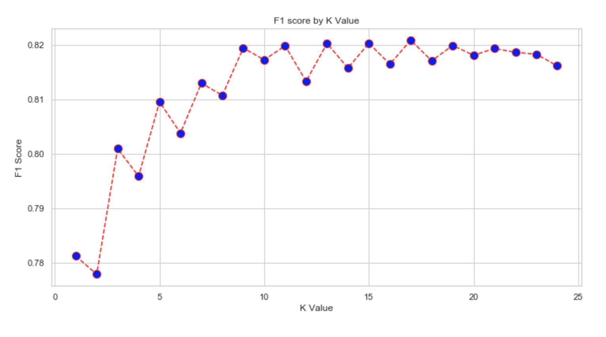 

**DecisionTreeClassifier**  

Decision Tree Accuracy: 0.7838427947598253  

Training F1 Score: 0.9318718699801568  
Testing F1 Score: 0.5522894290559638  

* Confusion matrix  
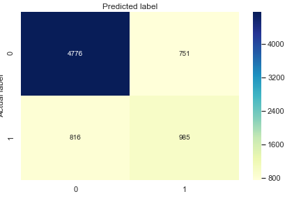 

After gridsearch:  

F1_Score: 0.6379165499859984  
Decision Tree Accuracy: 0.8235534934497817

* Post-gridsearch confusion matrix  
 

**Random Forrest**  

Random Forrest Accuracy: 0.8126364628820961  

Training F1 Score: 0.9338714115381087  
Testing F1 Score: 0.5974787452360012  

* Confusion matrix  
 

**XGBoost**  
initial parameters:
objective ='binary:logistic'  
colsample_bytree = 0.3  
learning_rate = 0.1  
max_depth = 5  
alpha = 10  
n_estimators = 200  

Accuracy: 0.845104
F1: 0.663704

* Confusion matrix  
 

